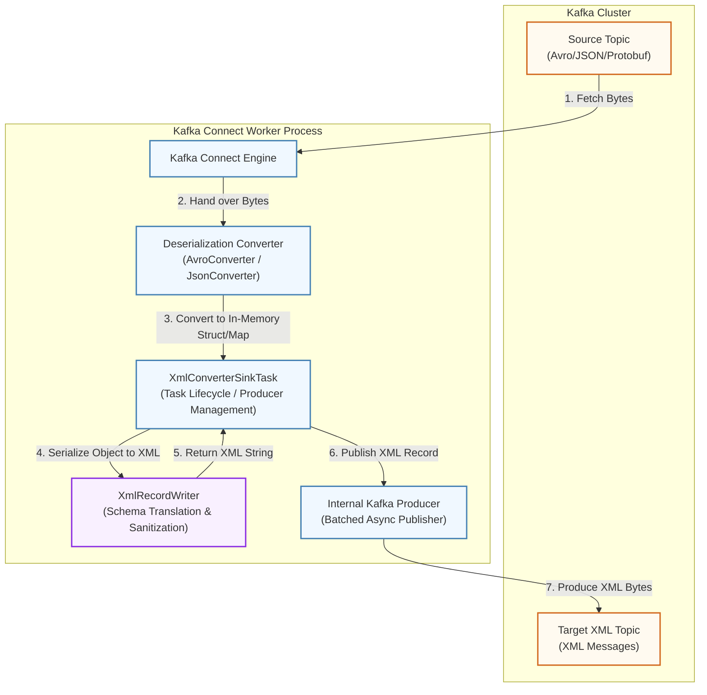

# Kafka Connect XML Converter Sink Connector

A high-performance, lightweight Kafka Connect Sink Connector that consumes records from a Kafka topic (serialized as Avro or JSON), translates the payloads (Struct or Map) into XML format, and publishes the serialized XML records to a target Kafka topic.

---

## Architectural Design

The connector acts as a bridge within the Kafka Connect ecosystem. It separates deserialization of incoming formats (Avro, JSON, Protobuf) from the XML generation and target publishing phases.



### Architectural Components

1. **Source Topic**: The origin topic containing messages serialized in standard Kafka formats such as Apache Avro (with Confluent Schema Registry) or JSON (with or without schema).
2. **Deserialization Converter**: The connector delegates record parsing to the standard built-in or plugin converters (`AvroConverter` or `JsonConverter`). The converter turns raw byte arrays from the source topic into JVM objects (specifically Kafka Connect `Struct` or standard Java `Map`).
3. **XmlConverterSinkTask**: Receives batches of deserialized records from the Connect framework. It manages the task lifecycle, configuration, and coordinates XML conversion and republishing.
4. **XmlRecordWriter**: A zero-dependency utility that recursively converts the `Struct`, `Map`, `Collection`, or primitive types into a standard-compliant XML string. It handles XML escaping, element tag sanitization, and base64-encoding for binary payloads.
5. **Internal Kafka Producer**: A dedicated Kafka Producer instance configured under the prefix `xml.producer.*`. It writes the generated XML strings to the target topic asynchronously to exploit batching optimizations, then blocks on batch completion futures before task completion to guarantee **at-least-once delivery**.
6. **Target XML Topic**: The destination topic containing the final, generated XML payload (wrapped by a configurable root element).

---

## Data Flow & Processing Lifecycle

Below is the step-by-step execution path for every record batch processed by the task:

1. **Polling**: The Kafka Connect engine polls records from the Source Topic and routes them to the converter.
2. **Task Intake**: Connect calls `SinkTask.put(Collection<SinkRecord> records)` with the deserialized records.
3. **XML Serialization**: For each `SinkRecord`, the task calls `XmlRecordWriter.convertToXml(...)` passing:
   - The record value payload.
   - The root tag name configured via `xml.root.element.name`.
4. **Sanitization & Escaping**: The writer cleans XML tags (removing invalid characters/spaces) and escapes illegal XML characters (such as `&`, `<`, `>`) in text values.
5. **Header & Key Propagation**: The task extracts the original key (as bytes) and all headers from the source record and copies them onto the target record.
6. **Asynchronous Dispatch**: The task submits the new record to the internal Kafka Producer.
7. **Commit Block**: The task waits for all pending producer writes in the current batch to acknowledge (`future.get()`). If any write fails, a `ConnectException` is thrown to halt offsets and force a retry.

---

## Detailed Example Walkthrough

This example details exactly how the connector takes a JSON/Avro record, transforms it, and formats the output XML.

### 1. The Input Payload (JSON or Avro Struct)
Consider a Kafka record in the source topic representing a user order. 
* If using **Avro/Schema Registry**, this is serialized as Avro bytes.
* If using **Schemaless JSON**, the record payload looks like this:

```json
{
  "order id": 9988,
  "customer": {
    "first name": "Alice & Bob",
    "status": "VIP"
  },
  "tags": ["retail", "urgent"],
  "binaryToken": "SGVsbG8="
}
```

### 2. Intermediate In-Memory Representation
The configured Converter deserializes the JSON/Avro bytes into Java memory. In the task, the object is resolved as:
* A `Map` (specifically `LinkedHashMap` for schemaless JSON).
* A `Struct` with schemas (for Avro or JSON-with-schema).

### 3. XML Conversion Logic
The task invokes `XmlRecordWriter.convertToXml(payload, "orderRecord")`. The writer performs the following operations:

* **Root Wrapping**: Creates opening `<orderRecord>` and closing `</orderRecord>` tags.
* **Tag Sanitization**: XML tags cannot contain spaces. The writer sanitizes key names:
  - `"order id"` $\rightarrow$ `<order_id>`
  - `"first name"` $\rightarrow$ `<first_name>`
* **Special Character Escaping**: XML-unsafe text values are escaped to prevent parsing errors:
  - `"Alice & Bob"` $\rightarrow$ `Alice &amp; Bob`
* **Array / Collection Handling**: Arrays are unrolled into repeating tags of the same name:
  - `"tags": ["retail", "urgent"]` $\rightarrow$ `<tags>retail</tags><tags>urgent</tags>`
* **Binary Serialization**: Binary fields (`byte[]`) are encoded to Base64 strings.

### 4. Output XML Message
The generated payload published to the target topic is:

```xml
<?xml version="1.0" encoding="UTF-8"?>
<orderRecord>
  <order_id>9988</order_id>
  <customer>
    <first_name>Alice &amp; Bob</first_name>
    <status>VIP</status>
  </customer>
  <tags>retail</tags>
  <tags>urgent</tags>
  <binaryToken>SGVsbG8=</binaryToken>
</orderRecord>
```

---

## Configuration Reference

| Property | Type | Importance | Default | Description |
| :--- | :--- | :--- | :--- | :--- |
| `xml.target.topic` | String | High | *(Required)* | The name of the Kafka topic where XML messages will be written. |
| `xml.root.element.name` | String | Medium | `record` | The root tag element for the generated XML documents. |
| `xml.producer.bootstrap.servers` | String | High | *(Required)* | Bootstrap servers for the internal Kafka Producer. |
| `xml.producer.*` | Config | Medium | - | Any standard Kafka Producer property can be passed to the internal producer by prefixing it with `xml.producer.` (e.g., `xml.producer.acks=all`). |

---

## Build & Installation

### Requirements
* Java JDK 11
* Apache Maven

### Steps
1. Clean and package the JAR:
   ```bash
   mvn clean package
   ```
2. Retrieve the plugin artifact from `target/kafka-xml-smt-1.0-SNAPSHOT-jar-with-dependencies.jar`.
3. Copy the JAR file to your Kafka Connect worker's plugins directory (e.g., `/usr/share/java/kafka/plugins/`).
4. Restart your Kafka Connect cluster instances to load the connector.

---

## Connector Deployment Example

Use the Kafka Connect REST API to deploy the connector. Below is an example payload to configure the connector for handling **Avro** data:

```bash
curl -X POST -H "Content-Type: application/json" \
  --data '{
    "name": "xml-converter-connector",
    "config": {
      "connector.class": "xml.converter.XmlConverterSinkConnector",
      "tasks.max": "3",
      "topics": "avro-source-orders",
      
      "key.converter": "org.apache.kafka.connect.storage.StringConverter",
      "value.converter": "io.confluent.connect.avro.AvroConverter",
      "value.converter.schema.registry.url": "http://localhost:8081",
      
      "xml.target.topic": "xml-target-orders",
      "xml.root.element.name": "orderRecord",
      
      "xml.producer.bootstrap.servers": "localhost:9092",
      "xml.producer.acks": "all",
      "xml.producer.retries": "5"
    }
  }' \
  http://localhost:8083/connectors
```

---

## Testing Environments

This project provides two fully automated end-to-end testing environments: a Docker Compose suite and a Kubernetes Strimzi Operator suite.

### Option 1: Local Docker Compose Testing

This environment uses a multi-container Docker Compose setup containing:
- ZooKeeper
- Kafka Broker
- Schema Registry
- Kafka Connect Custom Worker

#### Step-by-Step Execution:
1. Ensure your local Docker daemon is running.
2. Run the automated Docker Compose test script:
   ```bash
   ./test-env/test-end-to-end.sh
   ```

#### Manual Verification Commands:
If you wish to interact with the Docker environment manually:
1. Spin up the cluster:
   ```bash
   docker compose -f test-env/docker-compose.yml up --build -d
   ```
2. Wait for Kafka Connect to be healthy:
   ```bash
   curl -s http://localhost:8083/connectors
   ```
3. Register the connector:
   ```bash
   curl -X POST -H "Content-Type: application/json" \
     --data @test-env/connector-config.json \
     http://localhost:8083/connectors
   ```
4. Produce a sample Avro message to the source topic `avro-source`:
   ```bash
   SCHEMA_REGISTRY_CID=$(docker ps --filter "name=schema-registry" --format "{{.ID}}" | head -n 1)
   echo '{"id": 1001, "name": "Alice & Bob", "status": "active"}' | docker exec -i "$SCHEMA_REGISTRY_CID" kafka-avro-console-producer \
     --bootstrap-server kafka:29092 \
     --topic avro-source \
     --property value.schema='{"type":"record","name":"User","fields":[{"name":"id","type":"int"},{"name":"name","type":"string"},{"name":"status","type":"string"}]}'
   ```
5. Consume the XML message from the target topic `xml-target`:
   ```bash
   KAFKA_CID=$(docker ps --filter "name=kafka" --format "{{.ID}}" | head -n 1)
   docker exec -i "$KAFKA_CID" kafka-console-consumer \
     --bootstrap-server kafka:29092 \
     --topic xml-target \
     --from-beginning \
     --max-messages 1
   ```
6. Clean up:
   ```bash
   docker compose -f test-env/docker-compose.yml down -v
   ```

---

### Option 2: Kubernetes Testing (Strimzi Operator)

This environment deploys a Strimzi Kafka cluster, Schema Registry, and a custom Strimzi Kafka Connect worker using Kubernetes manifests.

#### Step-by-Step Execution:
1. Ensure local Kubernetes (e.g. Docker Desktop Kubernetes, Minikube, or Kind) is running and active in your current context.
2. Run the automated Kubernetes test script:
   ```bash
   ./strimzi-env/test-k8s.sh
   ```

#### Manual Verification Commands:
1. Create the `kafka` namespace:
   ```bash
   kubectl create namespace kafka
   ```
2. Install the Strimzi Cluster Operator:
   ```bash
   kubectl apply -f 'https://strimzi.io/install/latest?namespace=kafka' -n kafka
   ```
3. Build the custom Connect Docker image (loads the Java 11 fat JAR):
   ```bash
   docker build -t test-env-kafka-connect:strimzi-3.0 -f strimzi-env/Dockerfile.connect-strimzi .
   ```
4. Apply the Kubernetes manifests:
   ```bash
   kubectl apply -f strimzi-env/kafka-cluster.yaml
   kubectl apply -f strimzi-env/schema-registry.yaml
   kubectl apply -f strimzi-env/kafka-connect.yaml
   ```
5. Wait for all resources to become ready:
   ```bash
   kubectl wait --namespace kafka --for=condition=ready kafka/my-cluster --timeout=300s
   kubectl wait --namespace kafka --for=condition=ready pod --selector=app=schema-registry --timeout=120s
   kubectl wait --namespace kafka --for=condition=ready kafkaconnect/my-connect-cluster --timeout=300s
   ```
6. Produce a sample Avro record to `avro-source` inside the cluster:
   ```bash
   SCHEMA_REGISTRY_POD=$(kubectl get pod -n kafka -l app=schema-registry -o jsonpath="{.items[0].metadata.name}")
   echo '{"id": 2002, "name": "Alice & Bob (K8s)", "status": "active"}' | kubectl exec -i -n kafka "$SCHEMA_REGISTRY_POD" -- kafka-avro-console-producer \
     --bootstrap-server my-cluster-kafka-bootstrap:9092 \
     --topic avro-source \
     --property value.schema='{"type":"record","name":"User","fields":[{"name":"id","type":"int"},{"name":"name","type":"string"},{"name":"status","type":"string"}]}'
   ```
7. Consume the output XML message from `xml-target`:
   ```bash
   kubectl exec -i -n kafka my-cluster-kafka-node-pool-0 -c kafka -- bin/kafka-console-consumer.sh \
     --bootstrap-server localhost:9092 \
     --topic xml-target \
     --from-beginning \
     --max-messages 1
   ```
8. Clean up Connect cluster resources:
   ```bash
   kubectl delete kafkaconnect my-connect-cluster -n kafka
   ```
